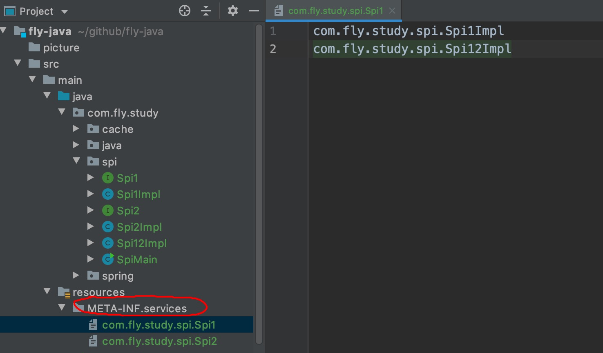

Java 语法
### Thread
```java
//守护线程中的 finally 可能不执行
 final Thread thread = new Thread(() -> {
            try {
                System.out.println(1);
                Thread.sleep(50);
            } catch (Exception e) {
                e.printStackTrace();
            } finally {
                System.out.println(2);

            }
        });
        thread.setDaemon(true);
        thread.start();

        final Thread thread2 = new Thread(() -> {
            try {
                System.out.println(3);
                Thread.sleep(5);
            } catch (Exception e) {
                e.printStackTrace();
            } finally {
                System.out.println(4);

            }
        });
        thread2.start();

//        thread2.join();
        System.out.println(6);
```

### 操作集合
```java
Collections.unmodifiableList
Collections.unmodifiableMap

```
```java
//guava 
ImmutableList
Throwables
Lists
Maps
```


### 加密解密
#### 摘要加密
- MD5、SHA-1、SHA-256、HMAC
#### 对称加密(可解密)
> 加密解密使用相同的秘钥
> AES
#### 非对称加密(可解密)
> 
### 路径问题
```java
    /**
     * 获取 classpath 路径
     */
    @Test
    public void run1() {
        URL resource = ClassLoaderDemo.class.getClassLoader().getResource("");
        System.out.println(resource.getPath());
    }
    
    /**
     * 相对于当前类下的路径
     */
    @Test
    public void run2() {
        URL resource = ClassLoaderDemo.class.getResource("");
        System.out.println(resource.getPath());
    }

    /**
     * 当前项目下的路径
     */
    @Test
    public void run3() {
        Path path = Paths.get("");
        System.out.println(path.toAbsolutePath());
    }

    /**
     * 获取当前项目路径
     */
    @Test
    public void run4() {
        File file = new File("");
        System.out.println(file.getAbsolutePath());
    }
```


### 泛型

- 泛型可以在类上或方法声明，方法上的泛型优先级高于类上的优先级
- 静态方法不能使用类上泛型声明，只能再方法上声明
- 常用的泛型声明(T，E，K，V，？)
  - ？表示不确定的 java 类型
  - T (type) 表示具体的一个java类型
  - K V (key value) 分别代表java键值中的Key Value
  - E (element) 代表Element
  - S、U、V 等：多参数情况中的第 2、3、4 个类型

### 代码验证

- 泛型可以在类上或方法声明，方法上的泛型优先级高于类上的优先级

```java
package com.fly.study.java.generics;

import org.junit.jupiter.api.BeforeEach;
import org.junit.jupiter.api.Test;

/**
 * @author 张攀钦
 * @date 2019-09-16-00:04
 * @description 泛型验证
 */
public class ClientTest<T> {

    /**
     * 限制方法参数的泛型和返回值类型,泛型优先使用方法上的，当方法上没有使用类上的
     * 不能这样 <K1 super Parent>
     */

    public <T extends ArgsParent, T2 extends ArgsParent> T2 run2(T k) {
        System.out.println(k.getName());
        System.out.println(k);
        return (T2) k;
    }
  

    @Test
    public void test2() {
        System.out.println(clientTest.run2(argsParent));
        System.out.println(clientTest.run2(argsSon));
        // 验证方法上的泛型优先于类上的泛型
        sonClientTest.run2(argsSon);
        // 下面用法错误
        // sonClientTest.run2(son);
    }
}

```

- 静态方法不能使用类上泛型声明，只能再方法上声明

```java
public class ClientTest<T> {
    /**
     * 静态方法上的泛型不能使用类上的，只能再方法上声明泛型
     */
    public static <T extends ArgsParent, T2 extends ArgsParent> void run4(T k) {
        System.out.println(k);
    }
  	
  	// 语法错误
    public static  void run4(T k) {
        System.out.println(k);
    }
}
```
### spi 加载某个冒下的类



```java
  ServiceLoader<Spi1> printerLoader = ServiceLoader.load(Spi1.class);
        for (Spi1 printer : printerLoader) {
            printer.log1();
        }
```
